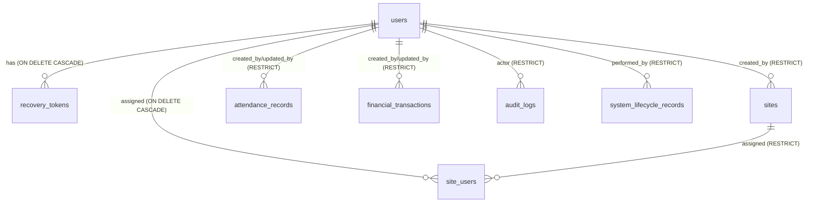
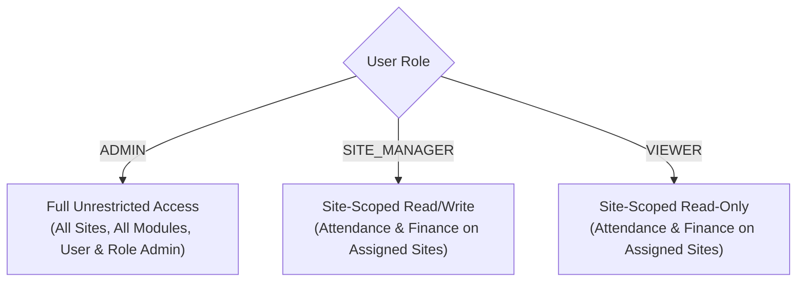
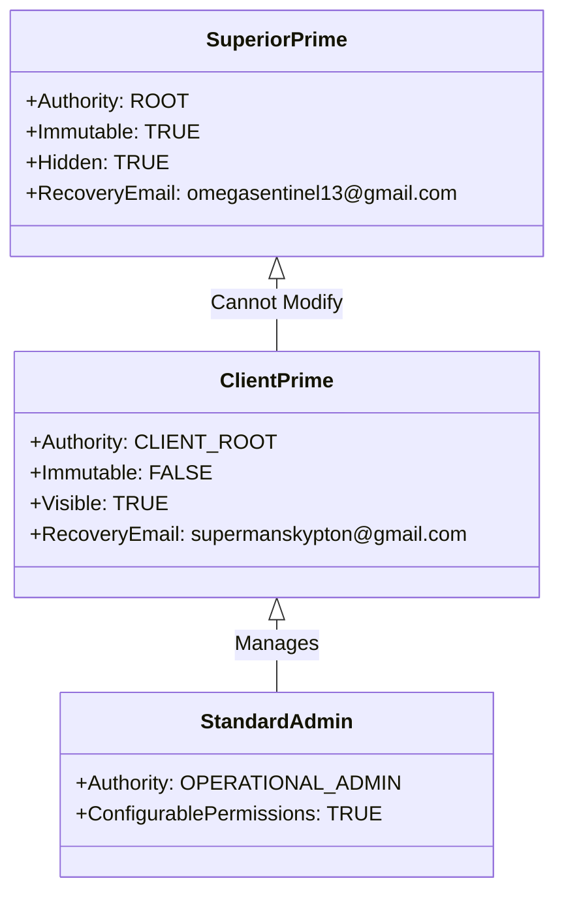
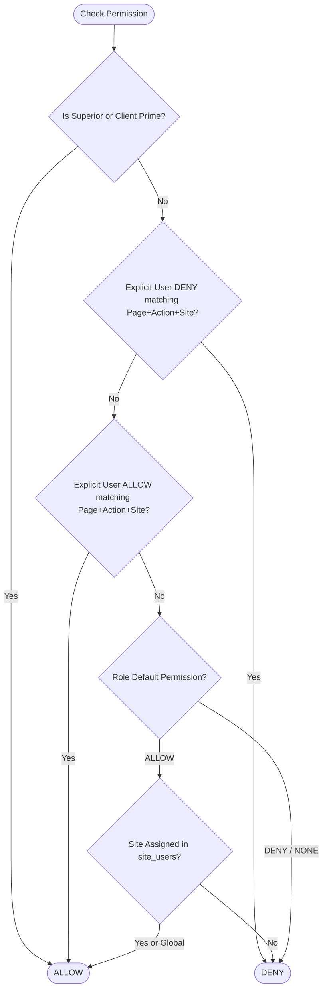
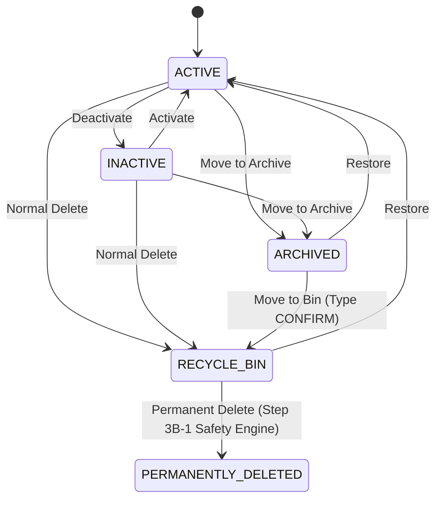
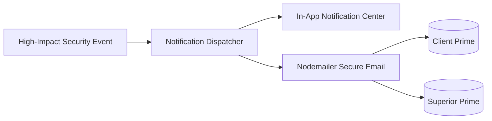

# USERS & ACCESS MODULE — FORENSIC CTO SECURITY & AUTHORIZATION ARCHITECTURAL AUDIT

**Audit Date:** September 19, 2026  
**Document Status:** COMPLETE — ARCHITECTURAL AUDIT ONLY — ZERO IMPLEMENTATION PERFORMED  
**CTO Authority:** Architecture & Security Review  
**Target Codebase:** SITE WORK (Next.js 14 App Router, Node.js `node:sqlite`, Tailwind CSS)

---

## EXECUTIVE SUMMARY

A forensic security, authorization, and architectural audit of the **Users & Access** module has been completed. The system was inspected strictly in read-only mode. **Zero implementation code, zero schema changes, zero database mutations, and zero git modifications have been performed.**

The current production database (`data/site_work.db`) has been verified and remains completely untouched at its exact baseline:
- **Users:** 4
- **Sites:** 6
- **Work Categories:** 4
- **Work Roles:** 23
- **Attendance Records:** 18
- **Financial Transactions:** 4
- **Audit Logs:** 429
- **System Lifecycle Records:** 0
- **PRAGMA integrity_check:** ok
- **PRAGMA foreign_key_check:** 0 errors

This audit establishes the comprehensive technical blueprint for introducing the dual **Prime Authority Architecture** (Superior Prime + Client Prime), **Granular Permission Matrix** (Principal + Page + Action + Site Scope with Explicit Deny), **User Lifecycle Engine** (Active/Inactive + Global Archive & Recycle Bin Integration), and **Tamper-Proof Audit Attribution**, while guaranteeing 100% backward compatibility with the legacy 3-role fallback (`ADMIN`, `SITE_MANAGER`, `VIEWER`).

---

## SECTION A: CURRENT ARCHITECTURE OVERVIEW

### 1. Technology Stack & Database Layer
- **Framework:** Next.js 14.2 (App Router with React Server Components & Client Components).
- **Runtime & Storage:** Node.js v24.16.0 with built-in synchronous SQLite (`node:sqlite`, `DatabaseSync`).
- **Data Persistence:** Single-file SQLite database with Write-Ahead Logging (`PRAGMA journal_mode = WAL; PRAGMA foreign_keys = ON;`).
- **Authentication:** Stateless signed JWTs (`jose` HS256) stored in `httpOnly`, `sameSite: 'lax'`, 24-hour cookie (`site_work_session`).
- **State Validation:** Stateful token revocation check via `token_version` column in the SQLite `users` table on every `getSession()` call.
- **Client State:** React Context (`SiteProvider` in `context/site-context.tsx`) polling `/api/auth/me` and `/api/sites`.

### 2. Current Entity Relationships


---

## SECTION B: CURRENT USER INVENTORY (PRODUCTION BASELINE)

The production database contains exactly 4 users:

| ID | Username | Full Name | Role | Recovery Email | Token Ver | Active | Created At | Direct Authorship |
|---|---|---|---|---|---|---|---|---|
| `usr-admin-1` | `Iamadmin` | Head Administrator | `ADMIN` | `omegasentinel13@gmail.com` | 11 | 1 (Active) | 2026-09-02 12:27 | 18 Attendance, 4 Finance, 6 Sites, 362 Audit Logs |
| `usr-eng-1` | `engineer2` | Site Engineer (Demo) | `SITE_MANAGER` | NULL | 4 | 1 (Active) | 2026-09-02 12:27 | 0 Records, 26 Audit Logs |
| `usr-view-1` | `viewer1` | Site Auditor (Demo) | `VIEWER` | NULL | 4 | 1 (Active) | 2026-09-02 12:27 | 0 Records, 8 Audit Logs |
| `usr-a8c8c116-936c-4c0a-ad26-f23c4922adf0` | `engineer1` | Live Site Engineer | `SITE_MANAGER` | NULL | 6 | 1 (Active) | 2026-09-02 14:53 | 0 Records, 6 Audit Logs |

### Site Assignment Inventory (`site_users` table):
- `engineer1` (`usr-a8c8c116...`) &rarr; Assigned to **Site 1** (`site-1`).
- `engineer2` (`usr-eng-1`) &rarr; Assigned to **Site 2** (`site-2`).
- `viewer1` (`usr-view-1`) &rarr; Assigned to **Site 1** (`site-1`).
- `Iamadmin` (`usr-admin-1`) &rarr; No explicit site assignment (as an `ADMIN`, system grants implicit universal site access).

---

## SECTION C: CURRENT RBAC (ROLE-BASED ACCESS CONTROL)

The current RBAC model is binary and rigid, defined by a CHECK constraint: `CHECK(role IN ('ADMIN', 'SITE_MANAGER', 'VIEWER'))`.



### Capabilities by Role:

1. **`ADMIN`:**
   - Universal access to all sites regardless of `site_users` entries.
   - Can view, create, edit, archive, and delete Sites, Roles, Categories, Attendance, and Finance.
   - Can access Setup pages (`/setup/users`, `/setup/roles`, `/setup/sites`, `/setup/categories`, `/setup/archive`, `/setup/recycle-bin`, `/setup/audit`).
   - Can create new users, modify user properties, reset passwords, change usernames, and delete non-author users.
   - **Vulnerability:** Any Admin can modify, demote, reset the password of, or delete any *other* Admin.

2. **`SITE_MANAGER` (Engineer):**
   - Restricted to sites listed in `session.assignedSiteIds`.
   - Can record and update Daily Attendance on assigned sites.
   - Can record and update Financial Transactions on assigned sites.
   - Blocked from Setup, User Management, Category Management, Role Configuration, and Audit Logs.

3. **`VIEWER`:**
   - Restricted to sites listed in `session.assignedSiteIds`.
   - Read-only access to Daily/Weekly/Monthly Attendance and Financial Transactions for assigned sites.
   - Blocked from any mutating (`POST`, `PUT`, `DELETE`, `PATCH`) operations.

---

## SECTION D: CURRENT SITE ACCESS MODEL

Site access is evaluated via `validateSiteAccess(session, siteId, action)` in `lib/auth/permissions.ts`:
```typescript
if (session.role === 'ADMIN') return;
if (action === 'ADMIN') throw new ForbiddenError('Administrator privileges required.');
if (action === 'WRITE' && session.role === 'VIEWER') throw new ForbiddenError('Viewer accounts have read-only access.');
if (siteId) {
  const isAssigned = session.assignedSiteIds.includes(siteId);
  if (!isAssigned) throw new ForbiddenError(`You do not have access to site: ${siteId}`);
}
```

### Critical Flaws in Current Site Access Model:
1. **No Fine-Grained Page/Action Mapping:** A `SITE_MANAGER` has `WRITE` access to everything within their assigned site. They cannot be granted Attendance access while denying Finance access.
2. **Falsy `siteId` Hole:** If `siteId` is passed as `undefined` or `null`, non-admins pass through the check unless `action === 'ADMIN'`!
3. **No Site-Specific Administrative Delegation:** An Admin cannot delegate site-level administration to a senior engineer without granting global system-wide Administrator rights.

---

## SECTION E: AUTHENTICATION SECURITY AUDIT

| Component | Current Implementation | Security Evaluation |
|---|---|---|
| **Password Hashing** | `bcryptjs` with 10 salt rounds (`bcrypt.hashSync(pw, 10)`) | &check; Secure against rainbow tables; synchronous call blocks event loop during heavy login load. |
| **Session Token** | Signed JWT (HS256) via `jose` library | &check; Cryptographically signed, 24h expiration, `httpOnly`, `sameSite: 'lax'`. |
| **Session Revocation** | `token_version` column in `users` table | &check; Effective when incremented on password/username changes. |
| **Logout Invalidation** | Client cookie cleared (`maxAge: 0`) | &#10060; **Defective.** `token_version` is NOT incremented on logout. Stolen JWT remains valid server-side for up to 24h. |
| **Brute-Force Protection** | None | &#10060; **High Risk.** No rate limiting, IP throttling, or account lockouts on login. |
| **Account Enumeration** | Explicit error distinction on login | &#10060; **High Risk.** Returns 403 "Account is disabled" vs 401 "Invalid credentials" vs timing difference for nonexistent users. |
| **Password Recovery** | 6-digit cryptographic OTP via Nodemailer, stored hashed in `recovery_tokens` | &check; Secure 15-min expiry, max 5 attempts, hashes plain token before storage. Limited to Admins only. |

---

## SECTION F: EXISTING USERS UI AUDIT (`app/(dashboard)/setup/users/page.tsx`)

Inspection of the 1,155-line Users page revealed substantial client-side functionality paired with **critical integration bugs**:

1. **Parameter Mismatches (Breaks Core UI Operations):**
   - **Edit User:** UI sends `{ userId, fullName, role, isActive, recoveryEmail, assignedSiteIds }`. The API (`app/api/users/route.ts` line 83) expects `{ id, fullName, role, isActive, recoveryEmail, siteIds }`. As a result, `id` is `undefined`, and the backend returns `HTTP 400: ID, full name, and role are required`.
   - **Reset Password Modal:** UI sends `{ userId, action: 'RESET_PASSWORD', newPassword }`. The API (line 125) expects `{ id, action: 'RESET_PASSWORD', newPassword }`. Fails with `HTTP 400: User ID and action are required`.
   - **Change Username Modal:** UI sends `{ userId, action: 'CHANGE_USERNAME', newUsername }`. The API expects `{ id, ... }`. Fails with `HTTP 400: User ID and action are required`.
   - **Create User:** UI sends `assignedSiteIds`, API expects `siteIds`. New users are created with zero site assignments regardless of checkbox selections!

2. **Missing Client-Side Route Protection:**
   - The page does not check `user?.role === 'ADMIN'` before rendering. A non-admin navigating to `/setup/users` sees the page structure, toolbar buttons, and modals. When `/api/users` returns 403, the table simply appears empty.

3. **Inadequate Authority Representation:**
   - All Admins are displayed with an identical "Administrator" badge. There is no distinction between Root/Platform Authority and Operational Admins.

---

## SECTION G: EXISTING API INVENTORY & AUTHORIZATION

| Endpoint | Method | Required Auth | Server-Side Enforcement | Weakness / Vulnerability |
|---|---|---|---|---|
| `/api/auth/login` | POST | Public | Validates hash & active status | Account enumeration, timing attack, zero rate limiting |
| `/api/auth/logout` | POST | Authenticated | Clears cookie | Does NOT revoke JWT server-side |
| `/api/auth/me` | GET | Authenticated | Reads cookie & validates `token_version` | Safe |
| `/api/auth/account` | POST/PUT/PATCH | Authenticated | Validates `currentPassword` for self-mutations | Safe for self; no rate limiting |
| `/api/auth/recovery/request` | POST | Public | Verifies active Admin + email | Generic response (good); zero rate limiting |
| `/api/auth/recovery/reset` | POST | Public | Verifies OTP hash & 5 attempt limit | Safe |
| `/api/auth/setup-admin` | POST | Public | `hasAdminUser()` race-safe check | Safe once admin exists |
| `/api/auth/setup-status` | GET | Public | Returns `{ isSetupRequired }` | Safe |
| `/api/users` | GET | Admin | `requireAdmin(session)` | Lists ALL users without tier filtering |
| `/api/users` | POST | Admin | `requireAdmin(session)` | Any Admin can create another Admin |
| `/api/users` | PUT | Admin | `requireAdmin(session)` | Parameter mismatch (`id` vs `userId`); Admin can demote another Admin |
| `/api/users` | PATCH | Admin | `requireAdmin(session)` | Parameter mismatch; Admin can hijack another Admin's credentials without step-up auth |
| `/api/users` | DELETE | Admin | `requireAdmin(session)` | Self-delete blocked, but Admin can delete other Admins; wipes audit attribution |
| `/api/sites` | GET/POST | Auth / Admin | `requireAdmin` for POST | Safe |
| `/api/sites/[id]` | GET/PUT/DELETE | Site-scoped / Admin | `requireAdmin` for mutate | Safe |
| `/api/roles` | GET/POST/PUT/DELETE| Site-scoped / Admin | `requireAdmin` for mutate | Safe |
| `/api/categories` | GET/POST/PUT/DELETE| Admin | `requireAdmin` for mutate | Safe |
| `/api/rates` | POST | Admin | `requireAdmin` | Safe |
| `/api/attendance/daily` | GET/POST | Site-scoped | `validateSiteAccess(..., 'WRITE')` | Coarse permission only |
| `/api/attendance/range` | GET | Site-scoped | `validateSiteAccess(..., 'READ')` | Coarse permission only |
| `/api/finance` | GET/POST | Site-scoped | `validateSiteAccess` | Coarse permission only |
| `/api/finance/[id]` | PUT/DELETE | Site-scoped | Step 0 hardened: derived from persisted `site_id` | Safe against cross-site tampering |
| `/api/lifecycle/...` | POST | Admin | `requireAdmin(session)` | No authority tier check |
| `/api/audit` | GET | Admin | `requireAdmin(session)` | No redaction of sensitive principals |

---

## SECTION H: FORENSIC VULNERABILITY REGISTER

### Vulnerability V-01: Parameter Mismatches Break User UI Mutations
- **Severity:** HIGH (Operational Bug)
- **Exact File:** `app/(dashboard)/setup/users/page.tsx` (lines 123, 159-164, 202, 237) vs `app/api/users/route.ts` (lines 44, 83, 125).
- **Root Cause:** UI submits `userId` and `assignedSiteIds`, whereas API expects `id` and `siteIds`.
- **Exploitation / Failure Path:** Legitimate Admin attempting to edit a user, assign sites, reset password, or change username from the UI receives immediate HTTP 400 rejection.
- **Impact:** Administrative user management is non-functional from the browser UI.
- **Mandatory Before Step 2:** YES. Must be harmonized during API/UI refactoring.

### Vulnerability V-02: Unrestricted Admin-on-Admin Modification & Privilege Escalation
- **Severity:** CRITICAL (Privilege Escalation)
- **Exact File:** `app/api/users/route.ts` (PUT, PATCH, DELETE handlers).
- **Root Cause:** Authorization only checks `session.role === 'ADMIN'`. There is no hierarchy or peer-protection check.
- **Exploitation Path:** Any standard administrator can issue a `PATCH /api/users` request with `{ id: targetAdminId, action: 'RESET_PASSWORD', newPassword: 'HackedPassword123!' }`. The API resets the target Admin's password with no re-authentication or step-up verification. The attacker can also demote or change the username of peer Admins.
- **Impact:** Total account takeover of peer and senior administrators.
- **Mandatory Before Step 2:** YES. Must be blocked by introducing authority tier validation.

### Vulnerability V-03: Hard Deletion of Users Nullifies Forensic Audit Attribution
- **Severity:** CRITICAL (Forensic Continuity Violation)
- **Exact File:** `lib/db/repositories/user-repo.ts` (lines 239 & 264 in `deleteUser`).
- **Root Cause:** To satisfy the SQLite foreign key constraint on `audit_logs(user_id REFERENCES users(id))`, the code executes:
  ```sql
  UPDATE audit_logs SET user_id = NULL WHERE user_id = ?;
  DELETE FROM users WHERE id = ?;
  ```
- **Exploitation Path:** When an administrator deletes a user who has not authored attendance or finance records (e.g. `usr-eng-1`), all 26 historical audit log entries authored by that user have their `user_id` permanently wiped to `NULL`.
- **Impact:** Destruction of forensic audit history and loss of legal attribution.
- **Mandatory Before Step 2:** YES. Users must move to `RECYCLE_BIN` via `system_lifecycle_records` instead of hard delete.

### Vulnerability V-04: Logout Does Not Invalidate JWT Server-Side (Replay Vulnerability)
- **Severity:** HIGH (Session Management)
- **Exact File:** `app/api/auth/logout/route.ts` (lines 17-18).
- **Root Cause:** Logout only clears the browser cookie via `clearSession()`. It does NOT call `incrementTokenVersion(userId)`.
- **Exploitation Path:** An attacker who intercepts a session token can continue using it for up to 24 hours even after the victim explicitly clicks "Logout".
- **Impact:** Lingering session vulnerability in shared or compromised environments.
- **Mandatory Before Step 2:** YES. `logout` must increment `token_version`.

### Vulnerability V-05: Account & Status Enumeration via Login Error Differentiators
- **Severity:** MEDIUM (Information Disclosure)
- **Exact File:** `app/api/auth/login/route.ts` (lines 24, 35, 47).
- **Root Cause:** Different response codes and messages:
  - Nonexistent user: 401 `"Invalid username or password"`
  - Disabled user: 403 `"Account is disabled. Please contact an Administrator."`
  - Timing disparity: Nonexistent user returns in <5ms; existing user computes bcrypt hash (~100ms).
- **Exploitation Path:** Automated scripts probe usernames to discover valid personnel accounts and identifying disabled accounts.
- **Impact:** Username harvesting and targeted social engineering.
- **Mandatory Before Step 2:** Recommended for Phase 1 hardening.

### Vulnerability V-06: Complete Absence of Rate Limiting on Authentication Endpoints
- **Severity:** HIGH (Brute Force)
- **Exact File:** `app/api/auth/login/route.ts`, `app/api/auth/recovery/request/route.ts`.
- **Root Cause:** No rate limiter or IP-based velocity checks.
- **Exploitation Path:** Attacker runs dictionary attacks against `/api/auth/login` or floods the recovery email API.
- **Impact:** Potential credential compromise or email spam blacklisting.
- **Mandatory Before Step 2:** Recommended for production security.

### Vulnerability V-07: Client-Side Route Exposure Without Next.js Middleware
- **Severity:** MEDIUM (Authorization Bypass in UI)
- **Exact File:** `app/(dashboard)/setup/users/page.tsx`, `components/layout/Navigation.tsx`.
- **Root Cause:** No Next.js `middleware.ts`. Navigation items are hidden in UI, but page routes load without server-side redirection for non-admins.
- **Exploitation Path:** A `VIEWER` directly navigates to `http://localhost:3000/setup/users`.
- **Impact:** Structural exposure of administrative tools (though API calls return 403).
- **Mandatory Before Step 2:** Recommended for defense-in-depth.

---

## SECTION I: PRIME ADMIN ARCHITECTURE COMPARISON

We evaluated three potential architectures for representing the dual Prime authority:



### Option A: `authority_tier` Column in `users` Table
- Add `authority_tier TEXT NOT NULL DEFAULT 'OPERATIONAL' CHECK(authority_tier IN ('SUPERIOR_PRIME', 'CLIENT_PRIME', 'STANDARD_ADMIN', 'OPERATIONAL'))`.
- **Pros:** Minimal schema changes; single table queries; easy indexation.
- **Cons:** High risk of accidental disclosure if queries do not strictly filter `WHERE authority_tier != 'SUPERIOR_PRIME'`. A bug in `getAllUsers()` leaks Superior Prime immediately.

### Option B: Separate `security_principals` Table
- Store root credentials and authority in a separate table completely detached from `users`.
- **Pros:** Maximum physical separation; impossible for `SELECT * FROM users` to leak Superior Prime.
- **Cons:** Breaks all existing foreign keys referencing `users(id)` (`created_by`, `updated_by`, `performed_by`, `audit_logs`). Requires complex UNION queries or synthetic user representations throughout attendance, finance, and sites.

### Option C: Hybrid Architecture (RECOMMENDED CTO CHOICE)
- Keep all identity accounts in `users` to maintain complete foreign key integrity and audit continuity.
- Add an explicit `authority_tier` column:
  `authority_tier TEXT NOT NULL DEFAULT 'OPERATIONAL' CHECK(authority_tier IN ('SUPERIOR_PRIME', 'CLIENT_PRIME', 'STANDARD_ADMIN', 'OPERATIONAL'))`
- Enforce **Strict Service-Layer Encapsulation**:
  - `getAllUsers()` is replaced with `getOperationalUsers(actingUserSession)`: If the caller is NOT Superior Prime, SQL query includes `WHERE authority_tier != 'SUPERIOR_PRIME'`.
  - Add a dedicated immutability trigger and repository guards preventing any non-Superior-Prime actor from modifying, resetting, or deleting Superior Prime.
  - Existing `role` column remains `'ADMIN'` for backward compatibility across all legacy checks.

---

## SECTION J: RECOMMENDED PRIME ARCHITECTURE DETAILS

### 1. Dual Prime Specifications
| Property | SUPERIOR PRIME | CLIENT PRIME | STANDARD ADMIN |
|---|---|---|---|
| **Identity / Role** | `authority_tier: 'SUPERIOR_PRIME'`, `role: 'ADMIN'` | `authority_tier: 'CLIENT_PRIME'`, `role: 'ADMIN'` | `authority_tier: 'STANDARD_ADMIN'`, `role: 'ADMIN'` |
| **Intended Recovery Email**| `omegasentinel13@gmail.com` | `supermanskypton@gmail.com` | Org-assigned or optional |
| **Visibility** | INVISIBLE to all users (including Client Prime) | Visible to Admins | Visible to Admins |
| **Creatable via UI?** | NO. Seeded or emergency CLI only. | By Superior Prime only. | By Superior Prime or Client Prime. |
| **Modifiable by Client Prime?**| NEVER. Hard rejected by API & DB trigger. | Self only (credentials). | Yes (by Client Prime). |
| **Deletable?** | NEVER. Hard rejected. | NEVER via normal delete. | Yes (to Recycle Bin). |
| **Granular Restrictions?** | Immume. Universal system bypass. | Immune to operational locks. | Governed by Permission Matrix. |

---

## SECTION K: GRANULAR PERMISSION MODEL

Permissions will follow the formal tuple:
$$\text{Permission} = \langle \text{Principal}, \text{Page/Module}, \text{Action}, \text{Site Scope} \rangle$$

### 1. Permission Matrix Structure (`user_permissions` Table)
```sql
CREATE TABLE IF NOT EXISTS user_permissions (
  id TEXT PRIMARY KEY,
  user_id TEXT NOT NULL REFERENCES users(id) ON DELETE CASCADE,
  page_id TEXT NOT NULL,
  action TEXT NOT NULL, -- 'VIEW', 'CREATE', 'EDIT', 'DELETE', 'EXPORT', 'MANAGE'
  site_id TEXT REFERENCES sites(id) ON DELETE CASCADE, -- NULL indicates global
  effect TEXT NOT NULL CHECK(effect IN ('ALLOW', 'DENY')),
  created_at TEXT NOT NULL DEFAULT (datetime('now')),
  UNIQUE(user_id, page_id, action, site_id)
);
```

### 2. Evaluator Precedence Order (Rule of Explicit Deny)
When evaluating `hasPermission(user, page, action, siteId)`:



1. **Root Prime Bypass:** Superior Prime and Client Prime have intrinsic ALLOW for all operations.
2. **User Explicit DENY:** If a record exists with `effect = 'DENY'` for that specific user, page, action, and site, access is **IMMEDIATELY REJECTED**.
3. **User Explicit ALLOW:** User-specific grant overrides role default.
4. **Role Baseline Default:** Falls back to legacy role matrix (`ADMIN` = full, `SITE_MANAGER` = site write, `VIEWER` = site read).
5. **System Fallback:** Implicit DENY.

---

## SECTION L: SITE-SCOPED ACCESS INTEGRATION

The new granular model coexists seamlessly with existing `site_users`:
- `site_users` remains the authoritative list of sites an Engineer or Viewer is assigned to.
- `user_permissions` adds micro-controls per site:
  - *Example:* Engineer A is assigned to `site-1` and `site-2` in `site_users`. In `user_permissions`, Engineer A has `page: 'ATTENDANCE', action: 'EDIT', site: 'site-1'` &rarr; ALLOW, but `page: 'FINANCE', action: 'VIEW', site: 'site-1'` &rarr; DENY.
- Server-side authorization in API routes derives access strictly from persisted resource ownership:
  `validatePermission(session, 'FINANCE', 'WRITE', persistedTransaction.site_id)`

---

## SECTION M: USER LIFECYCLE ARCHITECTURE

User accounts will be integrated with the global **System Lifecycle Engine** (`system_lifecycle_records`):



1. **Separation of Operational Status vs Lifecycle State:**
   - `is_active` (0 or 1) represents whether the user can currently authenticate.
   - `lifecycle_state` (`ACTIVE`, `ARCHIVED`, `RECYCLE_BIN`) represents visibility in the active management console.
2. **Normal Delete &rarr; RECYCLE_BIN:**
   - Clicking "Delete" in the UI does **NOT** execute `DELETE FROM users`.
   - It inserts a record into `system_lifecycle_records` with `state = 'RECYCLE_BIN'` and sets `is_active = 0`.
   - Sessions are immediately revoked via `token_version + 1`.

---

## SECTION N: USER DELETION SAFETY & HISTORICAL ATTRIBUTION

### Forensic Finding: The Foreign Key Dilemma
In SQLite, foreign keys referencing `users(id)`:
- `attendance_records(created_by, updated_by)`
- `financial_transactions(created_by, updated_by)`
- `sites(created_by)`
- `audit_logs(user_id)`
- `system_lifecycle_records(performed_by)`

### The Approved Attribution Strategy:
1. **Never Hard Delete Authors:** Any user who has authored financial or attendance records is permanently ineligible for hard database deletion. They can be `ARCHIVED` or kept in `RECYCLE_BIN` indefinitely.
2. **Snapshot Before Permanent Delete:** If a non-author user (e.g. an unassigned viewer with no authored business data) is permanently deleted via Step 3B-1:
   - A complete cryptographic JSON snapshot of the user record is sealed inside `system_lifecycle_records.metadata`.
   - Historical audit logs must NOT set `user_id = NULL`. Instead, the user row is replaced with a tombstone entry (`[Deleted User @username]`) or an immutable archival attribution record.

---

## SECTION O: CREDENTIAL & STEP-UP SECURITY ARCHITECTURE

1. **Step-Up Authentication Required For:**
   - Any password reset performed by an administrator on another user.
   - Any username change performed by an administrator.
   - Any change to Client Prime recovery credentials.
   - Permanent deletion of any user or site.
2. **Implementation:** Admin must enter their own current password before submitting credential modifications.
3. **Session Revocation Guarantee:** Every credential change and deactivation must atomically increment `token_version` in the same SQLite transaction.

---

## SECTION P: SECURITY NOTIFICATION ARCHITECTURE

High-impact security events will trigger multi-channel alerts to Prime authorities:



### Events Triggering Prime Notifications:
1. Secondary Admin created or deleted.
2. Administrative permissions or role modified.
3. Admin password reset or username changed.
4. User moved to Recycle Bin or permanently deleted.
5. Construction Site moved to Recycle Bin or permanently deleted.
6. Multiple consecutive failed login attempts on Prime accounts.

---

## SECTION Q: AUDIT TRAIL 2.0 COMPATIBILITY

Future audit logs will capture human-readable narratives alongside structured forensic state:
```typescript
interface EnhancedAuditRecord {
  who: string;           // e.g. "Head Administrator (@Iamadmin)"
  what: string;          // e.g. "USER_PERMISSION_UPDATE"
  target: string;        // e.g. "Site Engineer (@engineer1)"
  when: string;          // ISO Timestamp
  where: string;         // Site ID or "GLOBAL"
  narrative: string;     // "Head Administrator granted Finance EDIT permission to @engineer1 for Site 1"
  sourcePage: string;    // "/setup/users"
  securityLevel: 'LOW' | 'MEDIUM' | 'HIGH' | 'CRITICAL';
  beforeState: Record<string, unknown>;
  afterState: Record<string, unknown>;
}
```

---

## SECTION R: COMPLETE APPLICATION ROUTE & PAGE INVENTORY

All 23 user-facing routes in the application have been mapped to their security classifications:

| Route Path | Category | Target Permission Node | Legacy Access |
|---|---|---|---|
| `/login` | Public / Auth | Public | Everyone |
| `/forgot-password` | Public / Auth | Public | Everyone |
| `/setup/initial-admin` | Public / Auth | Public (One-time only) | Unauthenticated |
| `/` | Dashboard | `DASHBOARD:VIEW` | Everyone |
| `/attendance/daily` | Attendance | `ATTENDANCE_DAILY:VIEW/EDIT` | Site-scoped |
| `/attendance/weekly` | Attendance | `ATTENDANCE_WEEKLY:VIEW` | Site-scoped |
| `/attendance/monthly` | Attendance | `ATTENDANCE_MONTHLY:VIEW` | Site-scoped |
| `/finance` | Finance | `FINANCE_TRANSACTIONS:VIEW/EDIT` | Site-scoped |
| `/finance/monthly` | Finance | `FINANCE_LEDGER:VIEW` | Site-scoped |
| `/reports/role` | Analytics | `ANALYTICS:VIEW` | Site-scoped |
| `/reports/category` | Reports | `REPORTS_CATEGORY:VIEW` | Admin only |
| `/reports/site` | Reports | `REPORTS_SITE:VIEW` | Admin only |
| `/reports/complete-export` | Reports / Export | `COMPLETE_EXPORT:VIEW/EXPORT` | Admin only |
| `/admin/data-protection` | Governance | `DATA_PROTECTION:VIEW/MANAGE` | Admin only |
| `/admin/backup` | Governance | `BACKUP_CONSOLE:VIEW/MANAGE` | Admin only |
| `/setup/sites` | Setup | `SITES:VIEW/MANAGE` | Admin only |
| `/setup/categories` | Setup | `CATEGORIES:VIEW/MANAGE` | Admin only |
| `/setup/roles` | Setup | `ROLES:VIEW/MANAGE` | Admin only |
| `/setup/users` | Setup | `USERS:VIEW/MANAGE` | Admin only |
| `/setup/account` | Account | `MY_ACCOUNT:VIEW/EDIT` | Everyone (Self) |
| `/setup/archive` | Lifecycle | `GLOBAL_ARCHIVE:VIEW/RESTORE` | Admin only |
| `/setup/recycle-bin` | Lifecycle | `GLOBAL_RECYCLE_BIN:VIEW/PURGE` | Admin only |
| `/setup/audit` | Security | `AUDIT_TRAIL:VIEW` | Admin only |

---

## SECTION S: MIGRATION & BACKWARD COMPATIBILITY STRATEGY

1. **Zero Downtime Database Migration:**
   - Add `authority_tier TEXT NOT NULL DEFAULT 'OPERATIONAL'` to `users`.
   - Designate existing user `usr-admin-1` (`Iamadmin`) as `SUPERIOR_PRIME`.
   - Seed `CLIENT_PRIME` account (`supermanskypton@gmail.com`) cleanly without touching existing operational records.
   - Create `user_permissions` table.
2. **Backward Compatibility Guarantee:**
   - Existing 3 roles (`ADMIN`, `SITE_MANAGER`, `VIEWER`) remain valid in `users.role`.
   - If no granular rules exist in `user_permissions` for a user, the authorization evaluator falls back 100% to legacy role rules.

---

## SECTION T: THREAT MODEL & MITIGATION SUMMARY

| Threat Actor | Vector | Current Risk | Mitigated Architecture |
|---|---|---|---|
| Malicious Standard Admin | Elevate privileges or lock out Client Prime | CRITICAL | Blocked by `authority_tier` and peer mutation guards. |
| External Attacker | Brute force password on login | HIGH | Rate limiting + exponential backoff + timing-safe lookup. |
| Rogue Engineer | Tamper with financial transactions on another site | MITIGATED | Enforced via Step 0 server-side persisted resource validation. |
| Compromised Session | Stolen JWT reused after user logs out | HIGH | Immediate `token_version` increment on logout. |
| Malicious Client Prime | Attempt to discover or delete Superior Prime | CRITICAL | Superior Prime filtered at SQL repository layer; immune in DB. |

---

## SECTION U: QA ISOLATION & VERIFICATION STRATEGY

- **Production Port 3000 (`data/site_work.db`):** Strictly READ-ONLY during testing. Zero mutating QA allowed.
- **QA Test Server Port 3001 (`data/test_site_work.db`):** Dedicated to automated mutation testing. Disposable fixtures only.
- **Forbidden Actions:** Never run `DELETE FROM audit_logs`. Never execute destructive tests against the production baseline.

---

## SECTION V: RECOMMENDED IMPLEMENTATION PHASES (POST-AUDIT)

Upon explicit CTO approval, implementation should proceed in sequential, verifiable steps:

1. **Phase 1: Security Patch & Foundation Fixes (Zero Schema Changes)**
   - Fix UI/API parameter mismatches (`id` vs `userId`, `siteIds` vs `assignedSiteIds`).
   - Fix logout session revocation (`token_version + 1`).
   - Eliminate account enumeration on login.
2. **Phase 2: Authority Tier & Dual Prime Backend Foundation**
   - Add `authority_tier` column to `users`.
   - Map `usr-admin-1` to Superior Prime.
   - Seed Client Prime.
   - Implement Superior Prime invisibility filtering in `user-repo.ts`.
3. **Phase 3: Granular Permission Engine & Site-Scoped Access**
   - Create `user_permissions` table.
   - Implement permission evaluator with Explicit Deny.
   - Integrate with API route handlers.
4. **Phase 4: User Lifecycle Integration**
   - Integrate User Delete & Archive with `system_lifecycle_records`.
   - Implement User Restore from Recycle Bin.
5. **Phase 5: UI Refactoring & Polish**
   - Update `/setup/users` UI to support Prime badge, authority tiers, and granular permission editing.

---

## SECTION W: EXPLICIT "DO NOT CHANGE" LIST (FROZEN MODULES)

The following areas are **STRICTLY FROZEN** and must not be modified during Users & Access work:
1. **Attendance Engine:** `lib/domain/attendance-engine.ts`, `lib/db/repositories/attendance-repo.ts`.
2. **Finance Engine & Money Calculations:** `lib/domain/finance-engine.ts`, `lib/domain/money.ts`.
3. **Site Isolation Invariant (Step 0):** Deriving authorization from persisted `site_id` in `app/api/finance/[id]/route.ts`.
4. **Roles & Categories Visual Language:** Inverted navy-blue headers and layout polish frozen in Step 2.
5. **Global Archive & Recycle Bin Core Contract:** Confirmation semantics (`CONFIRM` for Recycle Bin, Step 3B-1 safety engine for permanent delete).
6. **Audit History Baseline:** The 429 existing production audit logs must never be deleted, rewritten, or truncated.
