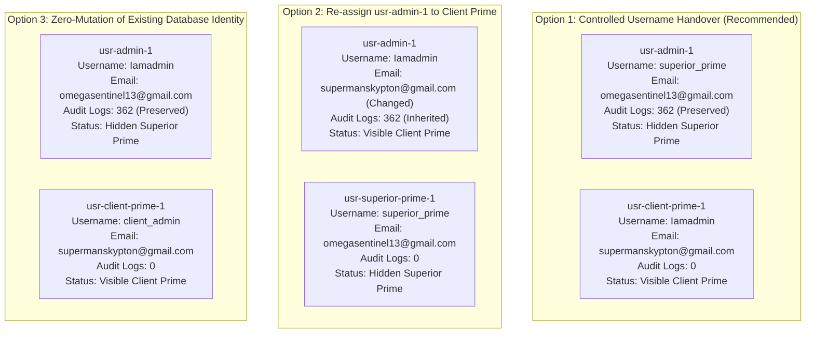

# USERS & ACCESS — IDENTITY RESOLUTION FORENSIC AUDIT

**Audit Date:** September 19, 2026  
**Document Status:** COMPLETE — FORENSIC ANALYSIS ONLY — ZERO DATABASE MUTATION PERFORMED  
**Target Codebase:** SITE WORK (`data/site_work.db`)

---

## EXECUTIVE SUMMARY

A forensic identity resolution audit was conducted to analyze the identity collision between the current production database state and the intended dual Prime architecture:

- **Intended Architecture:**
  1. **SUPERIOR PRIME:** Ultimate hidden platform authority. Recovery email: `omegasentinel13@gmail.com`.
  2. **CLIENT PRIME:** Client-facing operational authority. Intended username: `Iamadmin`. Temporary recovery email: `supermanskypton@gmail.com`.
- **Current Database Fact:**
  - Production user `usr-admin-1` already holds:
    - Username: `Iamadmin`
    - Recovery email: `omegasentinel13@gmail.com`
    - Role: `ADMIN`

This creates a direct collision on the unique username `Iamadmin` between the existing root database entity (which already carries the Superior Prime recovery email) and the intended Client Prime identity.

This audit evaluates the database dependencies, referential integrity, audit attribution, and provides 3 architectural options for resolution. **Zero mutations, zero renames, zero schema modifications, and zero implementation code were executed.**

---

## SECTION A: EXACT CURRENT IDENTITY OF `usr-admin-1`

A direct, read-only query of `data/site_work.db` reveals:

```json
{
  "id": "usr-admin-1",
  "username": "Iamadmin",
  "password_hash": "$2a$10$5OyO8KyDdbhAWQeVAVr43u9XFVO0JBfMbJ99jMjhZTkfOHRiHoTQS",
  "full_name": "Head Administrator",
  "role": "ADMIN",
  "recovery_email": "omegasentinel13@gmail.com",
  "token_version": 11,
  "is_active": 1,
  "created_at": "2026-09-02 12:27:45",
  "updated_at": "2026-09-02 16:35:10"
}
```

---

## SECTION B: CURRENT REFERENCES & DEPENDENCIES OF `usr-admin-1`

Every foreign key and business dependency linking to `usr-admin-1` was inspected:

| Dependent Table | Foreign Key Column | Count | Details |
|---|---|---|---|
| `sites` | `created_by` | **6** | Authored 100% of sites (`site-1`, `site-2`, and 4 UUID sites). |
| `attendance_records` | `created_by` / `updated_by` | **18** | Authored 100% of attendance records in the database. |
| `financial_transactions` | `created_by` / `updated_by` | **4** | Authored 100% of financial transactions in the database. |
| `audit_logs` | `user_id` | **362** | Actor on 362 out of 429 total audit logs (84.4% of total audit history). |
| `recovery_tokens` | `user_id` | **12** | 12 historical password recovery tokens (all consumed/expired). |
| `site_users` | `user_id` | **0** | No explicit site assignments (Admin has universal site access). |
| `system_lifecycle_records` | `performed_by` | **0** | No records currently exist in the lifecycle table. |

### Authorship Breakdown in `audit_logs`:
- `usr-admin-1`: **362** records (Site creation, Category creation, Role updates, Attendance updates, Finance transactions, Complete Exports, Security setups).
- `usr-eng-1` (`engineer2`): **26** records.
- `usr-view-1` (`viewer1`): **8** records.
- `usr-a8c8c116...` (`engineer1`): **6** records.
- `unauthenticated` / System (`NULL`): **27** records.

---

## SECTION C: CAN `usr-admin-1` SAFELY BECOME SUPERIOR PRIME WITHOUT CHANGING ITS ID?

**YES. Technically and architecturally, this is the most natural fit.**

1. **Email Pre-Alignment:** `usr-admin-1` is *already* configured with `recovery_email: 'omegasentinel13@gmail.com'`, which is the exact intended recovery email for Superior Prime.
2. **Referential Integrity:** `usr-admin-1` is the root entity that initialized the entire system (created all sites, roles, attendance, finance, and 362 audit logs). Retaining `id: 'usr-admin-1'` as Superior Prime maintains 100% foreign key integrity across all 6 dependent tables with zero cascading updates required.
3. **Immutability Protection:** Elevating `usr-admin-1` to `authority_tier: 'SUPERIOR_PRIME'` physically locks this root entity from being modified, demoted, or deleted by any operational user.

---

## SECTION D: CAN INTENDED CLIENT PRIME SAFELY USE USERNAME `Iamadmin`?

**Under SQLite constraints:**
`CREATE TABLE users (... username TEXT UNIQUE NOT NULL COLLATE NOCASE ...)`

1. Two users **cannot** possess `username: 'Iamadmin'` simultaneously.
2. Therefore, Client Prime can **only** use `username: 'Iamadmin'` if `usr-admin-1` yields the username `Iamadmin` through an explicit, atomic rename to a dedicated Superior Prime username (e.g. `superior_prime`).
3. Because foreign keys in SQLite reference `users(id)` and **not** `users(username)`, changing the `username` of `usr-admin-1` does not break or alter any foreign keys in `sites`, `attendance_records`, `financial_transactions`, or `audit_logs`.

---

## SECTION E: SAFEST ARCHITECTURE IF `usr-admin-1` MUST REMAIN UNCHANGED

If product governance mandates that `usr-admin-1` must remain completely untouched (including its username `Iamadmin`):

1. `usr-admin-1` remains `username: 'Iamadmin'`, `recovery_email: 'omegasentinel13@gmail.com'`.
2. It is designated `authority_tier: 'SUPERIOR_PRIME'` and completely filtered/hidden from normal API and UI visibility.
3. **Client Prime** must then be provisioned with a **distinct operational username**, such as:
   - `client_admin`
   - `orgadmin`
   - `prime`
   - `clientprime`
   With recovery email: `supermanskypton@gmail.com`.
4. This avoids any rename operations on `usr-admin-1`, but concedes the literal username `Iamadmin` to the hidden Superior Prime rather than Client Prime.

---

## SECTION F: SAFE USERNAME MIGRATION SEQUENCE (IF AUTHORIZED)

If the CTO authorizes Client Prime to take the username `Iamadmin`, the exact, safe transactional sequence would be:

```sql
BEGIN IMMEDIATE TRANSACTION;

-- 1. Free up the username 'Iamadmin' by renaming usr-admin-1 to superior_prime
UPDATE users 
SET username = 'superior_prime',
    token_version = token_version + 1,
    updated_at = datetime('now')
WHERE id = 'usr-admin-1';

-- 2. Insert the new Client Prime identity claiming the username 'Iamadmin'
INSERT INTO users (
  id, 
  username, 
  password_hash, 
  full_name, 
  role, 
  recovery_email, 
  token_version, 
  is_active, 
  created_at, 
  updated_at
) VALUES (
  'usr-client-prime-1',
  'Iamadmin',
  '<SECURE_BCRYPT_HASH>',
  'Client Administrator',
  'ADMIN',
  'supermanskypton@gmail.com',
  1,
  1,
  datetime('now'),
  datetime('now')
);

-- 3. Log identity migration and Client Prime provisioning into audit trail
INSERT INTO audit_logs (id, entity_type, entity_id, action, site_id, user_id, before_state, after_state, created_at)
VALUES (
  'audit-' || lower(hex(randomblob(16))),
  'SECURITY',
  'usr-admin-1',
  'IDENTITY_RESOLUTION_MIGRATION',
  NULL,
  'usr-admin-1',
  json_object('previousUsername', 'Iamadmin', 'assignedRole', 'SUPERIOR_PRIME'),
  json_object('newUsername', 'superior_prime', 'clientPrimeCreated', 'usr-client-prime-1'),
  datetime('now')
);

COMMIT;
```

### Safety Guarantees of this Sequence:
- **Foreign Key Stability:** `usr-admin-1` retains its primary key. All 362 audit logs, 18 attendance records, 4 finance records, and 6 sites remain anchored to `usr-admin-1`.
- **Session Revocation:** `token_version + 1` invalidates any lingering session tokens for the old username immediately.
- **Atomicity:** SQLite `BEGIN IMMEDIATE` guarantees that either both operations succeed or neither does, preventing any duplicate or orphaned state.

---

## SECTION G: AUDIT TRAIL ATTRIBUTION IDENTIFICATION

**Which identity should remain associated with existing audit history?**

- **Finding:** The entity that actually performed the 362 historical operations between 2026-09-02 and 2026-09-18 is `usr-admin-1` (holding recovery email `omegasentinel13@gmail.com`).
- **Verdict:** `usr-admin-1` (Superior Prime) **MUST** remain the attributed actor for all 362 historical audit logs.
- Re-attributing historical actions to a newly provisioned Client Prime account (`supermanskypton@gmail.com`) would be a falsification of forensic history, as Client Prime did not exist when those actions were performed.

---

## SECTION H: RECOVERY EMAIL ATTRIBUTION

**Should the current recovery email on `usr-admin-1` remain attached under the intended architecture?**

- Current email on `usr-admin-1`: `omegasentinel13@gmail.com`.
- Intended recovery email for Superior Prime: `omegasentinel13@gmail.com`.
- Intended recovery email for Client Prime: `supermanskypton@gmail.com`.
- **Verdict:** `usr-admin-1` **already holds the correct recovery email for Superior Prime**. It should remain attached to `usr-admin-1`. Client Prime should receive `supermanskypton@gmail.com` upon creation.

---

## SECTION I: COMPARISON OF 3 IDENTITY MAPPING OPTIONS



### Option 1: Controlled Username Handover
- `usr-admin-1` &rarr; Renamed `superior_prime`, retains ID `usr-admin-1`, retains `omegasentinel13@gmail.com`, retains 362 audit logs. Hidden from UI.
- `usr-client-prime-1` &rarr; Created fresh with username `Iamadmin`, `supermanskypton@gmail.com`. Operational Client Prime.
- **Pros:** 100% historical accuracy; gives Client Prime the exact intended username `Iamadmin`; Superior Prime recovery email stays untouched.
- **Cons:** Requires a one-time transactional username update on `usr-admin-1`.

### Option 2: Existing Identity Becomes Client Prime
- `usr-admin-1` &rarr; Keeps username `Iamadmin`, but recovery email is updated to `supermanskypton@gmail.com`. Becomes Client Prime.
- `usr-superior-prime-1` &rarr; Created fresh as Superior Prime with `omegasentinel13@gmail.com`.
- **Pros:** No username rename on `usr-admin-1`.
- **Cons:** Historically inaccurate (Client Prime inherits platform creation audit logs); mutates recovery email on `usr-admin-1`; breaks natural root lineage.

### Option 3: Zero-Mutation of Existing Database Identity
- `usr-admin-1` &rarr; Retains username `Iamadmin`, retains `omegasentinel13@gmail.com`, becomes hidden Superior Prime.
- `usr-client-prime-1` &rarr; Created fresh as Client Prime with username `client_admin` (or `orgadmin`) and `supermanskypton@gmail.com`.
- **Pros:** Zero modifications to existing `usr-admin-1` fields.
- **Cons:** Client Prime cannot use the exact username `Iamadmin`.

---

## SECTION J: ARCHITECTURAL RECOMMENDATION (FOR CTO REVIEW ONLY)

As an architectural recommendation—and **not** an executed decision:

**Option 1 (Controlled Username Handover)** provides the highest degree of security, forensic continuity, and user expectation fulfillment:
1. **Preserves Forensic Continuity:** `usr-admin-1` built the platform and retains full attribution for all 362 setup audit records.
2. **Preserves Root Credentials:** `omegasentinel13@gmail.com` remains with `usr-admin-1`.
3. **Delivers Client Expectation:** Client Prime logs in as `Iamadmin` with `supermanskypton@gmail.com`.
4. **Safe in SQLite:** In SQLite, changing `username` does not violate foreign keys because all foreign keys point to `id` (`TEXT PRIMARY KEY`), not `username`.

---

**AUDIT CONCLUSION:** The identity collision is fully mapped and documented. Awaiting explicit CTO authorization regarding which mapping option to execute.
