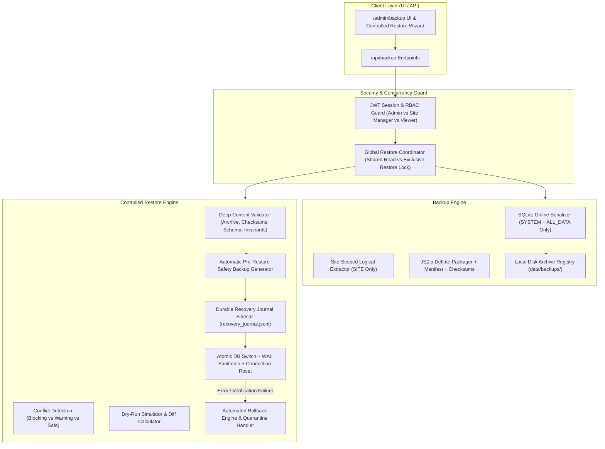
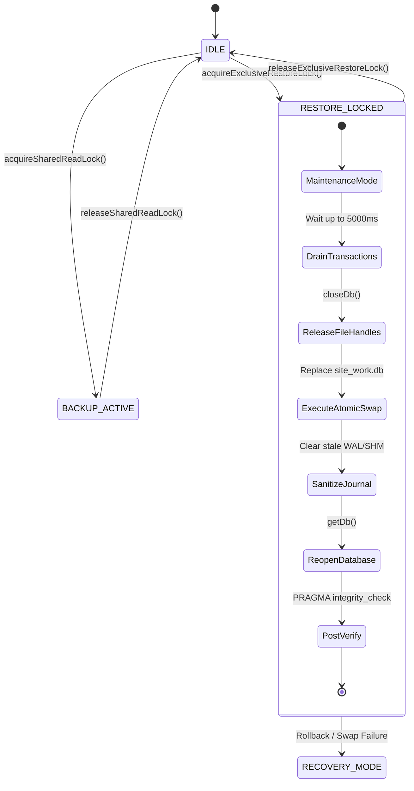
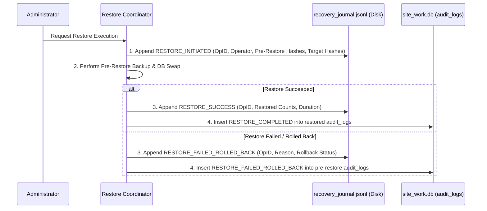
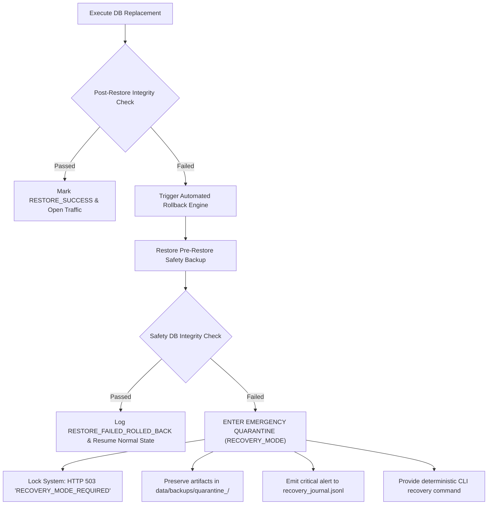

# IMPLEMENTATION PLAN — TASK 2: ENTERPRISE BACKUP, DISASTER RECOVERY & CONTROLLED RESTORE SYSTEM

**Project**: SITE WORK  
**Stage**: Architecture Discovery & Technical Implementation Plan (PLAN ONLY — REVISED & LOCKED)  
**Status**: SUBMITTED FOR APPROVAL  
**Task 1 Status**: FINAL ACCEPTED & FROZEN (Commit `9659614`)  

---

## 1. Executive Architecture

The **Enterprise Backup, Disaster Recovery & Controlled Restore System** provides SITE WORK with an enterprise-grade data protection, compliance archiving, and disaster recovery platform. It is engineered with defense-in-depth principles: zero-downtime consistent snapshots, strict tenant isolation, immutable audit logging across database replacements, exclusive restore coordination, and non-destructive coexistence with the frozen Task 1 reporting system.



---

## 2. Existing System Findings & Source of Truth

An exhaustive audit of the active codebase confirms the following foundational patterns:

| Architectural Area | Discovered Implementation | Mandatory Task 2 Boundary |
| :--- | :--- | :--- |
| **Authentication & Sessions** | `lib/auth/session.ts`: Stateless HMAC-SHA256 JWT tokens via `jose`, stored in `site_work_session` HttpOnly cookie. Tracks `userId`, `username`, `role`, `assignedSiteIds`, and `tokenVersion`. Each request verifies user existence, `is_active === 1`, and matching `token_version` in SQLite. | Restoring an older database alters user accounts and invalidates active sessions whose `token_version` or `user_id` differ. Admin must re-authenticate post-restore. |
| **Actual RBAC Role Constants** | `lib/auth/session.ts` and `schema.sql`: Strictly `'ADMIN'`, `'SITE_MANAGER'`, `'VIEWER'`. There is **NO** `'ENGINEER'` string constant in code or database. The role representing Engineer is canonically `'SITE_MANAGER'`. | Use `'ADMIN'`, `'SITE_MANAGER'`, and `'VIEWER'` constants verbatim. Map Engineer to `'SITE_MANAGER'` in UI labels and authorization checks. |
| **RBAC Enforcement** | `lib/auth/permissions.ts`: `validateSiteAccess(session, siteId, action)` and `requireAdmin(session)`. Rejects with `UnauthorizedError` (401) and `ForbiddenError` (403). | Enforce identical authorization patterns across all backup and restore endpoints. |
| **Database Connection** | `lib/db/index.ts`: Module-level singleton `dbInstance` using `node:sqlite` `DatabaseSync`. Configured with `PRAGMA journal_mode = WAL;` and `PRAGMA foreign_keys = ON;`. Provides `getDb()`, `runTransaction()`, and `closeDb()`. | During restore, `closeDb()` must be called to release open file locks on Windows; after restore, `getDb()` reopens connection cleanly. |
| **Database Schema** | `lib/db/schema.sql`: 10 tables: `users`, `recovery_tokens`, `sites`, `site_users`, `work_categories`, `work_roles`, `site_role_rates`, `attendance_records`, `financial_transactions`, `audit_logs`. | Schema compatibility checks must validate these tables and their foreign key constraints (`ON DELETE RESTRICT`). |
| **Audit Logging** | `lib/audit/logger.ts`: `logAudit(entry)` sanitizes passwords, hashes, tokens, and session secrets before writing to `audit_logs`. | To prevent audit loss when an old database replaces `audit_logs`, introduce a durable **Recovery Journal Sidecar** on disk. |
| **Task 1 Consolidation** | `lib/export/complete/`: Production-tested data collector (`data-collector.ts`), JSON generator (`json-generator.ts`), PDF consolidator (`pdf-consolidator.ts`), Excel consolidator (`excel-consolidator.ts`), period resolver (`periods.ts`), and ZIP packager (`zip-packager.ts`). | Reuse generators for reports; do not duplicate business math. Keep Task 1 100% frozen. |
| **UI Theme System** | Tailwind CSS (`slate-900`, `amber-500`), Light / Dark Theme toggle via `ThemeContext` and cookie `site_work_active_theme`. Minimum touch targets 44px. | All Task 2 UI components must support Light/Dark themes and comply with 44px touch target guidelines. |

---

## 3. RBAC Matrix & Role Boundaries

The security model strictly separates global administrative authority from scoped site supervision:

| Capability | Administrator (`ADMIN`) | Engineer / Site Manager (`SITE_MANAGER`) | Viewer (`VIEWER`) |
| :--- | :---: | :---: | :---: |
| **Access `/admin/backup` UI** | Yes (Full System + Sites) | Yes (Assigned Sites Only) | **No** (HTTP 403 / Hidden) |
| **Create `SYSTEM + ALL_DATA` Backup** | **Yes** (Disaster Recovery DB) | **No** (HTTP 403 Forbidden) | **No** (HTTP 403 Forbidden) |
| **Create `SITE + ALL_DATA` Backup** | Yes (Any Site) | Yes (Assigned Sites Only) | **No** (HTTP 403 Forbidden) |
| **Create `SITE + Date-Filtered` Archive** | Yes (Any Site) | Yes (Assigned Sites Only) | **No** (HTTP 403 Forbidden) |
| **Receive Full SQLite DB (`site_work.db`)** | **Yes** (`SYSTEM + ALL_DATA` only) | **STRICTLY NEVER** | **STRICTLY NEVER** |
| **Download Backup Archive** | Yes (All Backups) | Yes (Own Assigned Site Backups Only) | **No** (HTTP 403 Forbidden) |
| **View Backup History** | Yes (All History) | Yes (Own Assigned Site History Only) | **No** (HTTP 403 Forbidden) |
| **Validate Backup Archive** | Yes (All Backups) | Yes (Own Assigned Site Backups Only) | **No** (HTTP 403 Forbidden) |
| **Dry-Run / Simulate Restore** | **Yes** | **No** (HTTP 403 Forbidden) | **No** (HTTP 403 Forbidden) |
| **Execute Database Restore** | **Yes** (With Confirmation) | **No** (HTTP 403 Forbidden) | **No** (HTTP 403 Forbidden) |
| **Delete Backup Archive** | Yes | **No** (HTTP 403 Forbidden) | **No** (HTTP 403 Forbidden) |

---

## 4. Backup Semantics & Strict Site Data Isolation

### A. The Site Isolation Imperative
The production database `site_work.db` is a multi-tenant file containing:
- All users and their bcrypt password hashes
- All construction sites across the company
- All worker attendance records across all projects
- All financial transactions and cash flow ledgers across all projects
- Password recovery tokens and audit trails

> [!CAUTION]
> **STRICT SECURITY INVARIANT**:  
> Under NO circumstances may an Engineer (`SITE_MANAGER`) receive a copy of `site_work.db`. Providing a SQLite snapshot to an Engineer leaks unrelated site data, sensitive financial outlays, user lists, and authentication credentials.

### B. Formal Backup Classification Matrix

| Backup Type | Authorized Scope | Data Span | Contains SQLite DB? | Format & Contents | `restorableAsDatabase` | Target Audience |
| :--- | :---: | :---: | :---: | :--- | :---: | :--- |
| **Full System Disaster Recovery** | `SYSTEM` | `ALL_DATA` | **YES** (Standalone Snapshot) | `data/site_work.db`, `master_export.json`, Consolidated PDF, Consolidated Excel, manifest, checksums | **`true`** | **Admin Only** |
| **Site-Scoped Logical Backup** | `SITE` | `ALL_DATA` | **NO** (Strictly Excluded) | Filtered site JSON datasets, site PDF, site Excel, manifest, checksums | **`false`** | **Admin & Authorized Site Manager** |
| **Site-Scoped Reporting Archive** | `SITE` | Date-Filtered (e.g. `LAST_30_DAYS`) | **NO** (Strictly Excluded) | Filtered period site JSON datasets, site PDF, site Excel, manifest, checksums | **`false`** | **Admin & Authorized Site Manager** |
| **System Reporting Archive** | `SYSTEM` | Date-Filtered (e.g. `THIS_MONTH`) | **NO** (Strictly Excluded) | Multi-site period JSON, executive PDF, executive Excel, manifest, checksums | **`false`** | **Admin Only** |

### C. Exact Contents of a SITE Logical Backup
When an Engineer or Admin requests a `SITE` backup, the engine extracts **strictly isolated logical data**:
1. **`data/site_profile.json`**: Site ID, name, code, location, creation date (No other sites).
2. **`data/attendance_records.json`**: Records where `site_id = targetSiteId` only.
3. **`data/financial_transactions.json`**: Transactions where `site_id = targetSiteId` only.
4. **`data/utilized_roles.json`**: Work roles and categories actively referenced by this site's records (zero unrelated roles).
5. **`data/site_role_rates.json`**: Rate overrides for this specific site only.
6. **`data/site_audit_logs.json`**: Audit logs where `site_id = targetSiteId` only (zero user auth, security, or other site logs).
7. **`reports/site_complete_report.pdf`**: Consolidated Site PDF report.
8. **`reports/site_complete_report.xlsx`**: Consolidated Site Excel workbook.
9. **`manifest.json`** & **`checksums.sha256`**: Manifest with `scope: "SITE"` and `restorableAsDatabase: false`.

---

## 5. Restorable Database Invariant & Deep Validation

### The Invariant
> [!IMPORTANT]
> **RESTORABLE DATABASE INVARIANT**:  
> A backup archive is eligible for physical database restoration if and only if it represents an **unbounded, complete system-wide database image** generated under `SYSTEM + ALL_DATA`.  
> Any archive with `scope !== 'SYSTEM'`, `periodPreset !== 'ALL_DATA'`, or missing a valid `data/site_work.db` MUST be strictly rejected by the restore engine with a **BLOCKING** conflict.

### Deep Validation (Never Trust `manifest.json` Alone)
The restore validator unpacks the archive into an isolated staging sandbox (`data/backups/sandbox_<uuid>/`) and independently verifies:
1. **Archive Checksum**: Calculates streaming SHA-256 of the ZIP archive and compares against catalog.
2. **Manifest Integrity**: Verifies manifest syntax, version, and declared checksums.
3. **File Presence**: Confirms `data/site_work.db` physically exists inside the archive.
4. **Database Verification in Sandbox**:
   - Opens `data/site_work.db` with `new DatabaseSync(sandboxDbPath, { readOnly: true })`.
   - Runs `PRAGMA integrity_check` -> must return `ok`.
   - Runs `PRAGMA foreign_key_check` -> must return 0 violations.
   - Schema Verification: Queries `sqlite_master` to assert all 10 core tables exist:
     `users`, `recovery_tokens`, `sites`, `site_users`, `work_categories`, `work_roles`, `site_role_rates`, `attendance_records`, `financial_transactions`, `audit_logs`.
   - User Table Verification: Asserts at least one active `ADMIN` user exists in the `users` table.
   - Scope Assertion: Validates that `sites` table contains the authoritative site registry, not a single-site fragment.
5. **Rejection Rule**: If a user tampers with `manifest.json` to forge `restorableAsDatabase: true` on a site backup or date-filtered archive, the deep validator catches the missing file or structural disparity and blocks restoration immediately.

---

## 6. Global Restore Coordination around `DatabaseSync`

In SQLite, concurrent access during a physical file replacement results in file lock crashes (`EBUSY`/`EPERM` on Windows) or silent database corruption. To prevent this, Task 2 introduces a centralized **`RestoreCoordinator`** managing three distinct concurrency states:



### Concurrency Lock Rules:
1. **`BACKUP_ACTIVE` (Shared Read Lock)**:
   - Multiple backup creation tasks may run concurrently.
   - Normal application reads and writes proceed normally (WAL mode supports concurrent reads).
   - Restore requests are queued or rejected with `409 Conflict ("A backup operation is currently active. Please retry shortly.")`.
2. **`RESTORE_LOCKED` (Exclusive System Lock)**:
   - **Step 1: Maintenance Mode Barrier**: All incoming API routes (`/api/attendance/*`, `/api/finance/*`, `/api/export/*`) intercept the lock and immediately return `HTTP 503 Service Unavailable` with `Retry-After: 10` and header `X-System-Status: RESTORE_IN_PROGRESS`.
   - **Step 2: Transaction Draining**: Waits up to 5,000ms for any in-flight SQLite statements to complete.
   - **Step 3: Guard `getDb()`**: In `lib/db/index.ts`, `getDb()` checks `RestoreCoordinator.isLocked()`. If called during restore, it throws `DatabaseLockedError("Database connection is locked for maintenance.")`.
   - **Step 4: Release File Handles**: Calls `closeDb()` to cleanly close `dbInstance`, freeing Windows file descriptors on `site_work.db`, `site_work.db-wal`, and `site_work.db-shm`.
   - **Step 5: Pre-Restore Safety Backup**: Creates and verifies `data/backups/pre-restore-safety_[TIMESTAMP]_[UUID].zip`.
   - **Step 6: Atomic File Swap & Journal Sanitation**: Copies verified snapshot into `data/site_work.db`. Moves any existing `.db-wal` and `.db-shm` files to a temporary holding folder so old journal frames are NEVER replayed against the restored database.
   - **Step 7: Reconnect & Verify**: Calls `getDb()` to reopen the database, sets `PRAGMA journal_mode = WAL`, and executes `PRAGMA integrity_check`.
   - **Step 8: Lock Release**: Clears lock flag and removes on-disk lock marker.
3. **Interrupted Restore Crash Recovery**:
   - Before file replacement, the coordinator writes an on-disk lock marker: `data/backups/.restore_active_marker`.
   - On application startup (`lib/db/index.ts` initialization), the system checks for this marker:
     - If found: The previous restore was interrupted by a server crash or power failure. The system automatically enters `RECOVERY_MODE`, prevents normal writes, and initiates recovery from the pre-restore backup.

---

## 7. Audit Continuity Across Restore (Durable Recovery Journal Sidecar)

### The Problem
When an older database is restored, the SQLite `audit_logs` table is replaced with the historical snapshot. Any audit records generated between the backup date and the restore date are overwritten. Furthermore, if the restore fails or rolls back, SQLite transaction logs cannot reliably record what happened.

### The Solution: Append-Only Local Recovery Journal Sidecar
Task 2 implements an external, append-only journal file:
`data/backups/recovery_journal.jsonl`

This file lives outside the SQLite database and is **never overwritten by database restores**.



### Structure of `recovery_journal.jsonl` Entries:
```json
{
  "eventId": "rec-ev-9a8b7c6d",
  "operationId": "restore-op-20260905-213000-4b2a",
  "eventType": "RESTORE_INITIATED",
  "timestamp": "2026-09-05T21:30:00.120Z",
  "operator": { "userId": "usr-admin-1", "username": "admin", "role": "ADMIN" },
  "sourceBackup": {
    "backupId": "bak-20260905-200000",
    "scope": "SYSTEM",
    "sha256": "51d10875...",
    "declaredCounts": { "users": 4, "sites": 6, "attendance": 11, "finance": 4 }
  },
  "preRestoreDatabase": {
    "sizeBytes": 233472,
    "sha256": "13a70589...",
    "counts": { "users": 4, "sites": 6, "attendance": 11, "finance": 4, "audit_logs": 350 }
  }
}
```

```json
{
  "eventId": "rec-ev-9a8b7c6e",
  "operationId": "restore-op-20260905-213000-4b2a",
  "eventType": "RESTORE_SUCCESS",
  "timestamp": "2026-09-05T21:30:02.450Z",
  "restoredDatabaseSha256": "b7a1601e...",
  "verifiedCounts": { "users": 4, "sites": 6, "attendance": 11, "finance": 4 },
  "preRestoreBackupPath": "data/backups/pre-restore-safety_20260905_213000.zip",
  "durationMs": 2330
}
```

### Guarantees:
1. **Durable Evidence**: Even if `site_work.db` is rolled back 6 months, `recovery_journal.jsonl` retains chronological proof of who restored the system, when, and from what backup file.
2. **Forensic Traceability**: If the server fails mid-restore, the journal records the exact step that was executing.
3. **Database Audit Integration**: When SQLite reopens successfully, a matching `RESTORE_COMPLETED` record is written into the newly restored `audit_logs` table.

---

## 8. Rollback Failure & Emergency Recovery Architecture

The rollback mechanism accounts for all failure modes to ensure the system never enters an unrecoverable or silently corrupted state:



### Failure Modes & Deterministic Handling:

| Failure Scenario | Immediate Action | Secondary Action | Final State |
| :--- | :--- | :--- | :--- |
| **1. File Swap Failed (EPERM / Lock)** | Abort swap; keep active database file intact. | Release locks; log failure to journal sidecar. | Reopen active DB; return `HTTP 500 (SWAP_FAILED)`. No data loss. |
| **2. Restored DB Corrupt / Check Failed** | `closeDb()`; delete corrupt `site_work.db`. | Copy pre-restore safety snapshot into place; re-clear WAL/SHM. | Reopen pre-restore DB; return `HTTP 500 (RESTORE_ROLLED_BACK)`. Pre-restore state preserved. |
| **3. Rollback Snapshot Damaged** | Check secondary fallback: forensic baseline `backups/forensic-2026-09-02/`. | Quarantine current directory into `data/backups/quarantine_<uuid>/`. | Enter `SYSTEM_RECOVERY_REQUIRED`. Return `HTTP 503`. |
| **4. Process Crashes Mid-Swap** | On restart, startup hook detects `.restore_active_marker`. | Halts normal init; inspects pre-restore backup; restores safety snapshot. | Recovers pre-restore state before accepting any HTTP requests. |
| **5. Rollback Itself Fails** | Disconnect database; freeze coordinator in `EMERGENCY_QUARANTINE`. | Quarantine all files; output detailed diagnosis to `recovery_journal.jsonl`. | Operator CLI recovery path activated. Zero false success reports. |

### Deterministic Operator Recovery CLI
If catastrophic hardware or filesystem failure causes both restore and rollback to fail, the administrator has an emergency offline CLI utility:
```bash
npm run recovery:status
npm run recovery:emergency-restore -- --snapshot=data/backups/pre-restore-safety_<timestamp>.zip
```
This utility operates outside the Next.js server, cleanly re-initializes the database from the safety backup, sanitizes journals, and clears the quarantine lock.

---

## 9. Backup Package Structure & Artifact Specification

### File Layout inside Backup ZIP:
```text
SITE_WORK_BACKUP_[SCOPE]_[TIMESTAMP]_[ID].zip
├── manifest.json                  # Cryptographic metadata, declared SHA-256 catalog, and invariants
├── README.txt                     # Human-readable instructions, site registry, and safety notices
├── checksums.sha256               # Standard sha256sum format checksum list
├── data/
│   ├── site_work.db               # Standalone, verified SQLite snapshot (ONLY in SYSTEM + ALL_DATA)
│   ├── master_export.json         # Complete JSON data tree (SYSTEM scope)
│   ├── site_profile.json          # Site metadata (SITE scope)
│   ├── attendance_records.json    # Attendance records (SITE scope)
│   ├── financial_transactions.json# Financial ledger (SITE scope)
│   ├── utilized_roles.json        # Roles utilized by site (SITE scope)
│   └── site_audit_logs.json       # Site-specific audit logs (SITE scope)
└── reports/
    ├── consolidated_report.pdf    # Enterprise 12-section PDF report
    └── consolidated_report.xlsx   # Enterprise multi-sheet Excel spreadsheet
```

---

## 10. Cryptographic Manifest Design (`manifest.json`)

```json
{
  "manifestVersion": "2.0.0",
  "backupId": "bak-20260905-214500-a1b2",
  "backupTimestamp": "2026-09-05T21:45:00.000Z",
  "projectName": "SITE WORK",
  "applicationVersion": "1.0.0",
  "schemaVersion": "1.2.0",
  "scope": "SYSTEM",
  "siteId": null,
  "siteName": "ALL SITES",
  "periodPreset": "ALL_DATA",
  "isUnbounded": true,
  "dateRange": { "startDate": null, "endDate": null },
  "restorableAsDatabase": true,
  "createdBy": {
    "userId": "usr-admin-1",
    "username": "admin",
    "role": "ADMIN"
  },
  "database": {
    "included": true,
    "isStandalone": true,
    "sizeBytes": 233472,
    "sha256": "b7a1601e43b9b9359f67d6cdf2a60b93ed533bad82d6b97430b5892b81510c95",
    "integrityCheck": "ok",
    "tableCounts": {
      "users": 4,
      "sites": 6,
      "site_users": 3,
      "work_categories": 4,
      "work_roles": 23,
      "attendance_records": 11,
      "financial_transactions": 4,
      "audit_logs": 350
    }
  },
  "files": [
    {
      "path": "data/site_work.db",
      "format": "SQLITE",
      "sizeBytes": 233472,
      "sha256": "b7a1601e43b9b9359f67d6cdf2a60b93ed533bad82d6b97430b5892b81510c95"
    },
    {
      "path": "data/master_export.json",
      "format": "JSON",
      "sizeBytes": 15420,
      "sha256": "3a4f5c6d..."
    },
    {
      "path": "reports/consolidated_report.pdf",
      "format": "PDF",
      "sizeBytes": 286549,
      "sha256": "8d9e2a1b..."
    },
    {
      "path": "reports/consolidated_report.xlsx",
      "format": "XLSX",
      "sizeBytes": 16420,
      "sha256": "1c2d3e4f..."
    }
  ],
  "security": {
    "envLocalExcluded": true,
    "sessionSecretsExcluded": true,
    "databaseContainsProductionAuthenticationData": true
  }
}
```

---

## 11. Conflict Model & Severity Classification

The restore validator evaluates the target backup against the active system and tags every finding:

| Conflict Condition | Severity | System Behavior |
| :--- | :---: | :--- |
| **Missing `data/site_work.db`** | **BLOCKING** | Abort immediately. Archive contains no physical database snapshot. |
| **`scope !== 'SYSTEM'` (Site backup fed to restore)** | **BLOCKING** | Abort immediately. Site logical backups cannot replace system database. |
| **`periodPreset !== 'ALL_DATA'` (Date-scoped archive)** | **BLOCKING** | Abort immediately. Scoped archives would destroy historical records. |
| **`restorableAsDatabase !== true`** | **BLOCKING** | Abort immediately. Archive is flagged as non-restorable. |
| **Checksum mismatch on any file or DB** | **BLOCKING** | Abort immediately. Archive is corrupted or has been tampered with. |
| **SQLite `PRAGMA integrity_check !== 'ok'`** | **BLOCKING** | Abort immediately. Database corruption detected. |
| **SQLite `PRAGMA foreign_key_check` failures** | **BLOCKING** | Abort immediately. Referential integrity violation. |
| **Missing core business tables** | **BLOCKING** | Abort immediately. Incompatible schema. |
| **Zero active Administrator accounts** | **BLOCKING** | Abort immediately. Restore would lock out all administrative access. |
| **Target system has sites not present in backup** | **WARNING** | Prompt user. Explains missing sites will be superseded by backup state. |
| **Target system has newer audit records** | **WARNING** | Prompt user. Explains audit_logs table will reflect historical state (sidecar preserved). |
| **Clean match with active database** | **SAFE** | State re-application / zero data drift. |

---

## 12. UI / UX Specification (`/admin/backup`)

The Backup & Disaster Recovery Center matches SITE WORK's accepted design language (Tailwind, Slate/Amber, Light/Dark, 44px touch targets).

### Layout Sections:
1. **Header Strip**: System status indicator, active lock indicator, storage quota overview.
2. **Card 1: Create Backup**:
   - Scope Selector: Full System (`SYSTEM`) vs Project Site (`SITE`).
   - If `SYSTEM`: period options include `ALL_DATA (Disaster Recovery)` with prominent badge indicating full restorable database included.
   - If `SITE`: dropdown limited to authorized sites; badge indicating site-scoped logical archive (non-restorable over full DB).
   - Format toggles: SQLite DB, Excel, PDF, JSON.
   - Download Button with progress spinner and lock against double-clicks.
3. **Card 2: Backup History & Archive Registry**:
   - Table of stored backups with timestamp, scope, data span, restorable badge, file size, SHA-256 snippet, and action buttons (`Download`, `Validate`, `Restore`).
   - For Engineers: filtered strictly to their assigned site backups; `Restore` button hidden.
4. **Card 3: Controlled Database Restoration (Admin Only)**:
   - File upload zone supporting drag-and-drop of `.zip` backup packages.
   - Validation & Preview trigger button.

### Multi-Step Controlled Restore Modal (Admin Only):
- **Step 1: Deep Verification**: Live progress checking ZIP integrity, SHA-256 hashes, SQLite pages, and schema.
- **Step 2: Conflict & Severity Report**: Displays Blocking, Warning, and Safe findings with color-coded alerts.
- **Step 3: Record Diff Preview**: Table displaying:
  - Users: Current (4) → Restored (4)
  - Sites: Current (6) → Restored (6)
  - Attendance Records: Current (11) → Restored (11)
  - Financial Transactions: Current (4) → Restored (4)
  - Audit Logs: Current (350) → Restored (350) + Note: Journal Sidecar Preserved
- **Step 4: Explicit Confirmation**: User must type `RESTORE CONFIRM` in an uppercase input field.
- **Step 5: Execution & Status**: Live terminal progress:
  - `[1/6] Locking system traffic (Maintenance Mode)...`
  - `[2/6] Generating automatic pre-restore safety backup...`
  - `[3/6] Releasing database handles & sanitizing journal...`
  - `[4/6] Executing atomic file replacement...`
  - `[5/6] Reopening connection & verifying integrity...`
  - `[6/6] Writing recovery journal & restore audit entry...`
  - `✔ Restoration Complete. Reloading session.`

---

## 13. API Route Architecture

| Route | Method | Access | Description |
| :--- | :---: | :---: | :--- |
| `/api/backup` | `GET` | Admin, Site Manager | Returns list of backup archives filtered by authorized scope. |
| `/api/backup` | `POST` | Admin, Site Manager | Creates and streams backup ZIP archive; records audit log. |
| `/api/backup/[id]` | `GET` | Admin, Site Manager | Downloads specific backup archive by ID; verifies site ACL. |
| `/api/backup/[id]` | `DELETE` | Admin Only | Deletes specific backup archive from server disk storage. |
| `/api/backup/validate` | `POST` | Admin, Site Manager | Validates uploaded or stored backup; returns integrity report. |
| `/api/backup/restore/simulate` | `POST` | Admin Only | Dry-run simulation; returns conflict report and record diff. |
| `/api/backup/restore/execute` | `POST` | Admin Only | Executes atomic restore with pre-restore backup, rollback, and journal sidecar. |
| `/api/backup/recovery/status` | `GET` | Admin Only | Returns recovery journal entries, lock status, and quarantine state. |

---

## 14. File & Module Structure

```text
SITE WORK/
├── lib/
│   ├── backup/
│   │   ├── types.ts                   # Core interfaces: Manifest, Diff, Conflicts, Journal
│   │   ├── coordinator.ts             # Global restore lock, shared read lock, crash detection
│   │   ├── snapshot-engine.ts         # SQLite online serialization (SYSTEM) & logical extractor (SITE)
│   │   ├── manifest-service.ts        # Cryptographic manifest generation & deep verification
│   │   ├── checksum-service.ts        # Streaming SHA-256 calculation & validation
│   │   ├── packager.ts                # JSZip assembly with sanitize & security filters
│   │   ├── storage-registry.ts        # Disk archive storage, listing, and retention management
│   │   ├── journal-sidecar.ts         # Append-only recovery journal sidecar (recovery_journal.jsonl)
│   │   └── index.ts                   # Public backup module interface
│   ├── restore/
│   │   ├── deep-validator.ts          # Archive, checksum, sandbox SQLite & schema verification
│   │   ├── conflict-detector.ts       # Classification of Blocking, Warning, Safe conflicts
│   │   ├── restore-planner.ts         # Dry-run simulation & record diff calculation
│   │   ├── restore-executor.ts        # Atomic DB swap, pre-restore backup & automated rollback
│   │   ├── quarantine-manager.ts      # Quarantine handler & emergency recovery scripts
│   │   └── index.ts                   # Public restore module interface
├── app/
│   ├── (dashboard)/
│   │   └── admin/
│   │       └── backup/
│   │           └── page.tsx           # Full Backup & Disaster Recovery Center UI
│   └── api/
│       └── backup/
│           ├── route.ts               # GET (history) / POST (create backup)
│           ├── [id]/
│           │   └── route.ts           # GET (download) / DELETE
│           ├── validate/
│           │   └── route.ts           # POST (validate archive)
│           ├── recovery/
│           │   └── status/
│           │       └── route.ts       # GET (recovery status & journal)
│           └── restore/
│               ├── simulate/
│               │   └── route.ts       # POST (dry-run & conflict preview)
│               └── execute/
│                   └── route.ts       # POST (controlled transactional execution)
├── components/
│   └── backup/
│       ├── BackupCreateCard.tsx       # Backup creation controls (Scope, Period, Formats)
│       ├── BackupHistoryTable.tsx     # Backup archive registry with actions
│       ├── BackupUploadZone.tsx       # Drag-and-drop backup archive uploader
│       └── RestoreModal.tsx           # 5-step controlled restore wizard dialog
└── tests/
    ├── backup-rbac.test.ts            # RBAC access & boundary enforcement tests
    ├── backup-generation.test.ts      # Snapshot creation, site logical isolation & packaging tests
    ├── restore-simulation.test.ts     # Deep validation, conflict detection & diff tests
    ├── restore-concurrency.test.ts    # Global restore lock, maintenance mode & race prevention
    ├── restore-audit-continuity.test.ts# Journal sidecar persistence & audit survival tests
    └── restore-execution.test.ts      # Atomic swap, pre-restore backup & rollback failure tests
```

---

## 15. Acceptance Test Strategy

The verification suite guarantees strict correctness across all edge cases:

### 1. RBAC & Site Isolation Tests (`backup-rbac.test.ts`)
- Admin can generate `SYSTEM + ALL_DATA` backup containing standalone SQLite DB.
- Engineer (`SITE_MANAGER`) can generate `SITE + ALL_DATA` backup containing ONLY site-scoped JSON.
- Engineer backup archive contains ZERO unrelated site data, ZERO other site users, and ZERO user password hashes.
- Engineer attempting `SYSTEM` scope backup is rejected with `403 Forbidden`.
- Engineer attempting unassigned site backup is rejected with `403 Forbidden`.
- Viewer (`VIEWER`) attempting any backup/restore endpoint is rejected with `403 Forbidden`.
- Non-admin attempting any restore endpoint is rejected with `403 Forbidden`.

### 2. Restore Semantics & Deep Validation Tests (`restore-simulation.test.ts`)
- `SITE` logical backup fed into restore engine is strictly rejected as **BLOCKING**.
- Date-filtered archive fed into restore engine is strictly rejected as **BLOCKING**.
- Forged manifest claiming `restorableAsDatabase: true` without valid DB is rejected as **BLOCKING**.
- Incomplete SQLite database missing core tables is rejected as **BLOCKING**.
- Database with foreign key violations is rejected as **BLOCKING**.
- Archive with checksum mismatch is rejected as **BLOCKING**.
- Valid `SYSTEM + ALL_DATA` backup produces a clean, accurate record diff plan.

### 3. Concurrency & Coordinator Tests (`restore-concurrency.test.ts`)
- Restore lock rejects concurrent restore attempts with `409 Conflict`.
- Application write requests during restore receive `503 Service Unavailable (RESTORE_IN_PROGRESS)`.
- Calls to `getDb()` during file replacement throw `DatabaseLockedError`.
- Interrupted restore marker on disk is detected on startup and triggers `RECOVERY_MODE`.

### 4. Audit Continuity Tests (`restore-audit-continuity.test.ts`)
- Successful restore logs `RESTORE_INITIATED` and `RESTORE_SUCCESS` into `recovery_journal.jsonl`.
- Successful restore logs `RESTORE_COMPLETED` into the restored database's `audit_logs` table.
- Failed restore logs `RESTORE_FAILED_ROLLED_BACK` into both `recovery_journal.jsonl` and SQLite.
- Restoring an older snapshot preserves complete pre-restore journal history on disk.

### 5. Rollback & Quarantine Tests (`restore-execution.test.ts`)
- Pre-restore safety backup is automatically generated and verified before file replacement.
- Simulated file corruption post-swap triggers 100% automated rollback to pre-restore state.
- Simulated double-failure (swap fails + rollback fails) enters `EMERGENCY_QUARANTINE` state, locks access, and outputs actionable CLI recovery diagnostics.
- Never falsely reports success under any circumstance.

### 6. Regression Suite
- `npm test` continues passing all 169 existing tests.
- `npx tsc --noEmit` passes with 0 errors.
- `npm run build` compiles all static and dynamic routes.

---

## 16. Acceptance Criteria

Task 2 will be approved only when:
1. **Site Isolation**: Engineer site backups contain ONLY site-scoped data; zero SQLite system databases exposed.
2. **Restorable Invariant**: Physical database restore accepts ONLY verified `SYSTEM + ALL_DATA` backups.
3. **Deep Validation**: Deep archive and SQLite inspection catches tampered manifests, corrupt pages, and schema drift.
4. **Coordination**: Global restore lock coordinates `DatabaseSync` lifecycle, enforces maintenance mode, and prevents reopening races.
5. **Safety Backup**: Pre-restore safety backup is generated automatically prior to database modification.
6. **Audit Continuity**: Recovery journal sidecar preserves permanent audit evidence across database replacements.
7. **Rollback**: Failed restores automatically roll back; double failures cleanly quarantine with deterministic CLI recovery.
8. **UI/UX**: Responsive interface supporting Light/Dark themes and 44px touch targets.
9. **Task 1 Frozen**: Zero modifications to Task 1 code or test suites.

---

## 17. Explicit Non-Goals & Boundaries
- **NO Cloud Storage / S3 / GCP**: Storage is local to the server filesystem (`data/backups/`); user downloads archives via browser.
- **NO Business Logic Changes**: Calculations in attendance and finance engines remain unchanged.
- **NO Schema Mutations**: Business database tables remain strictly intact.
- **NO Git / Deployment Actions**: Development remains local; no commits, pushes, or deployments.

---

## 18. Task 1 Freeze Protection Confirmation
- All Task 1 modules (`lib/export/complete/`, `app/(dashboard)/reports/complete-export/`, `app/api/export/complete/`) remain **100% FROZEN**.
- The existing verified project backup (`backups/SITE_WORK_TASK1_FINAL_ACCEPTED_2026-09-05.zip`) and forensic baseline (`backups/forensic-2026-09-02/`) remain untouched on disk.
- Localhost remains stopped.
- Git commit remains `9659614`.
